# Qexed 项目调用地图

> 个人阅读用。本文基于当前仓库的静态代码阅读整理，重点记录“从哪里进入、调用到哪里、各模块如何协作”。它不是运行时 trace，也不逐个枚举所有私有辅助函数；对于函数数量很大的模块，按职责和主调用路径归纳。

## 1. 总览

Qexed 是一个 Rust workspace，核心二进制是 `crates/qexed`，周边 crate 提供配置、协议包、TCP 包帧、NBT、玩家/实体模型、插件 API、日志、性能分析和 CLI 工具。

整体可以分为四层：

1. 应用层：`qexed`，负责启动、加载配置、管理服务器上下文、网络连接、游戏 Play 状态、世界、实体、插件、权限、玩家数据等。
2. 协议层：`qexed_protocol`、`qexed_packet`、`qexed_tcp_connect`、`qexed_nbt`，负责 Minecraft 协议 packet、字段编解码、TCP frame、压缩、加密、NBT。
3. 数据/公共模型层：`qexed_config`、`qexed_player`、`qexed_entity`、`qexed_plugin_api`、`qexed_log`、`qexed_profiler`。
4. 工具和扩展层：`qexed_tools`、`plugins/examples`、`tools/mc-vanilla-protocol`、`tools/test_text_server`。

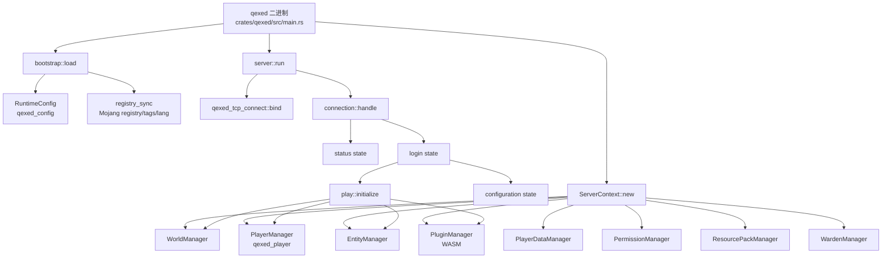

## 2. Workspace crate 关系

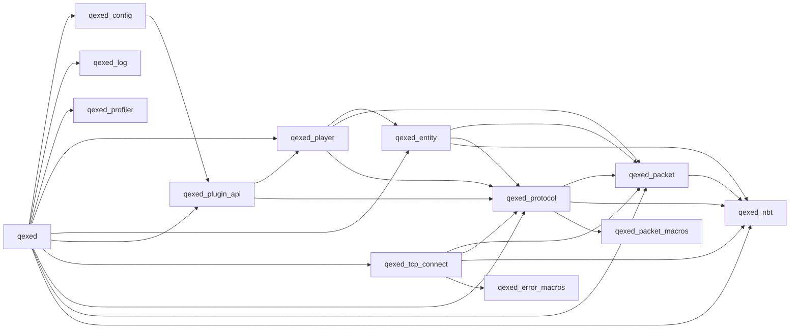

| crate | 职责 | 主要被谁调用 |
| --- | --- | --- |
| `qexed` | 服务器主程序和业务实现 | 用户运行的二进制 |
| `qexed_config` | 配置结构、默认值、配置加载工具 trait | `qexed`、工具 |
| `qexed_log` | tklog 初始化、模块化日志输出 | `bootstrap::load` |
| `qexed_profiler` | span 采样、实体采样、HTML 报告 | `qexed::profiler`、控制台命令 |
| `qexed_packet` | `Packet` / `PacketCodec` trait、基础网络类型 | 协议、TCP、业务 |
| `qexed_protocol` | Minecraft 26.1.2 packet 定义 | `connection`、`play`、世界/实体/玩家发包 |
| `qexed_tcp_connect` | TCP bind、PacketStream、PacketSink、压缩/加密/帧 | `server`、`connection`、`play` |
| `qexed_nbt` | NBT Tag、读写、serde、网络 NBT | 协议、世界、文本组件 |
| `qexed_player` | 在线玩家状态、广播、玩家包构造 | `qexed::players` re-export |
| `qexed_entity` | 实体 ID、实体模型、实体包基础 | `qexed::entities`、`qexed_player` |
| `qexed_plugin_api` | 插件事件枚举、payload、manifest、占位符文档 | `qexed::plugins`、示例插件 |
| `qexed_tools` | favicon、行为准则、安装包、插件管理 CLI | 独立 CLI |
| `qexed_*_macros` | packet、config、error 派生/属性宏 | 编译期使用 |

## 3. 主启动链路

入口在 `crates/qexed/src/main.rs`。

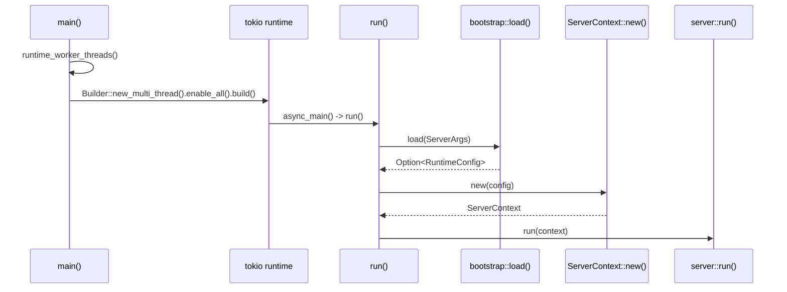

关键点：

- `runtime_worker_threads()` 读取 `QEXED_WORKER_THREADS`，非法或缺省时使用 2。
- `async_main()` 捕获 `run().await` 的错误并打印/log，最后返回 `Ok(())`，避免 panic 式退出。
- `run()` 用 `qexed_config::app::qexed::qexed_args::ServerArgs::parse()` 解析 CLI 参数。
- `bootstrap::load()` 如果检测到 `--init-settings`，返回 `Ok(None)`，主流程直接退出。

## 4. 配置加载链路

`RuntimeConfig::load(language, config_path)` 不是只读一个 `qexed.toml`，而是把多个配置 app 合并到运行时结构。

```mermaid
flowchart TD
    RuntimeLoad["RuntimeConfig::load"] --> Qexed["Qexed::load_or_create_default"]
    RuntimeLoad --> Server["QexedServer::apply_to"]
    RuntimeLoad --> Proxy["QexedProxy::apply_to"]
    RuntimeLoad --> Lan["QexedLanDiscovery"]
    RuntimeLoad --> PlayerData["QexedPlayerData"]
    RuntimeLoad --> Messages["QexedPlayerMessages"]
    RuntimeLoad --> Audit["QexedPlayerAudit"]
    RuntimeLoad --> Filter["QexedContentFilter"]
    RuntimeLoad --> Perm["QexedPermissions"]
    RuntimeLoad --> Pack["QexedResourcePack"]
    RuntimeLoad --> Entity["QexedEntity"]
    RuntimeLoad --> Npc["QexedNpc -> npc_to_entity"]
    RuntimeLoad --> Rendering["QexedEntityRendering"]
    RuntimeLoad --> Scoreboard["QexedScoreboard"]
    RuntimeLoad --> Menus["QexedMenus"]
    RuntimeLoad --> Enchant["QexedEnchanting"]
    RuntimeLoad --> Placeholder["QexedPlaceholders"]
    RuntimeLoad --> Lobby["QexedLobby"]
    RuntimeLoad --> World["World::load_or_create_default"]
    RuntimeLoad --> Warden["QexedWarden"]
```

`bootstrap::load()` 在配置之后继续做运行前准备：

- 设置 `rust_i18n` locale。
- 初始化 `qexed_log::log_init()`。
- 输出系统、版本、配置摘要。
- 配置 Mojang cache 路径。
- `registry_sync::ensure_data_ready()` 保证 registry/tag/lang 所需数据可用。
- `l10n::initialize()` 从 Mojang lang 目录加载本地化资源。

## 5. ServerContext 组合关系

`ServerContext` 是运行时依赖容器。多数业务函数不直接全局取状态，而是从 context 拿共享 manager。

```mermaid
flowchart TD
    C["ServerContext"] --> Config["Arc<RuntimeConfig>"]
    C --> Auth["Authenticator"]
    C --> World["WorldManager"]
    C --> Rules["WorldRulesManager"]
    C --> Ore["OrePitManager"]
    C --> ClusterEntities["Option<ClusterEntityController>"]
    C --> Players["PlayerManager"]
    C --> Fluid["FluidRuntime"]
    C --> Entities["EntityManager"]
    C --> PlayerData["PlayerDataManager"]
    C --> Permissions["PermissionManager"]
    C --> Plugins["PluginManager"]
    C --> Profiler["qexed_profiler::Profiler"]
    C --> Audit["PlayerAuditLogger"]
    C --> Filter["ContentFilter"]
    C --> Pack["ResourcePackManager"]
    C --> Conduct["CodeOfConductTexts"]
    C --> Warden["WardenManager"]
```

构造顺序里的重要调用：

- `PluginManager::load_default()` 创建插件管理器，但延迟到 `ensure_plugins_initialized()` 时真正加载/初始化。
- `world::generator::from_config()` 创建本地世界生成器。
- `ClusteredWorldGenerator::from_config()` 在 world cluster 配置完整时包一层远端 shard 路由。
- `WorldManager::with_generator(...).with_worlds(...).with_instances(...).with_edit_regions(...).with_precompiled_chunks(...)` 组装世界。
- `PlayerDataManager::from_config()` 根据配置选择 disabled、vanilla、MongoDB、MySQL。
- `PermissionManager::from_config()` 根据配置选择 local 或 LuckPerms MySQL。
- `EntityManager::from_config_with_skin_lookup()` 根据配置实体/NPC/皮肤初始化实体管理。
- `ResourcePackManager::from_config().start()` 对本地资源包启动下载 HTTP 服务。
- 插件 host service 注入：pathfinding、world edit、entity control、economy、structured storage。

## 6. 网络服务器与关停

`server::run(context)` 是 TCP accept loop。

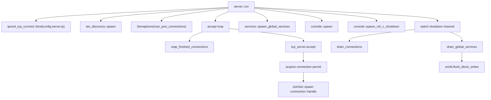

并发模型：

- 每个客户端连接是一个 tokio task。
- `JoinSet` 保存连接任务，循环内回收已完成连接。
- `watch::Sender<bool>` 用于控制台和 Ctrl-C 触发关停。
- 关停时最多等待连接 10 秒、全局服务 5 秒，超时 abort。
- 退出前调用 `WorldManager::flush_block_writes()` 刷盘。

## 7. 连接状态机

`connection::handle()` 管理 Handshake 后的状态分流。

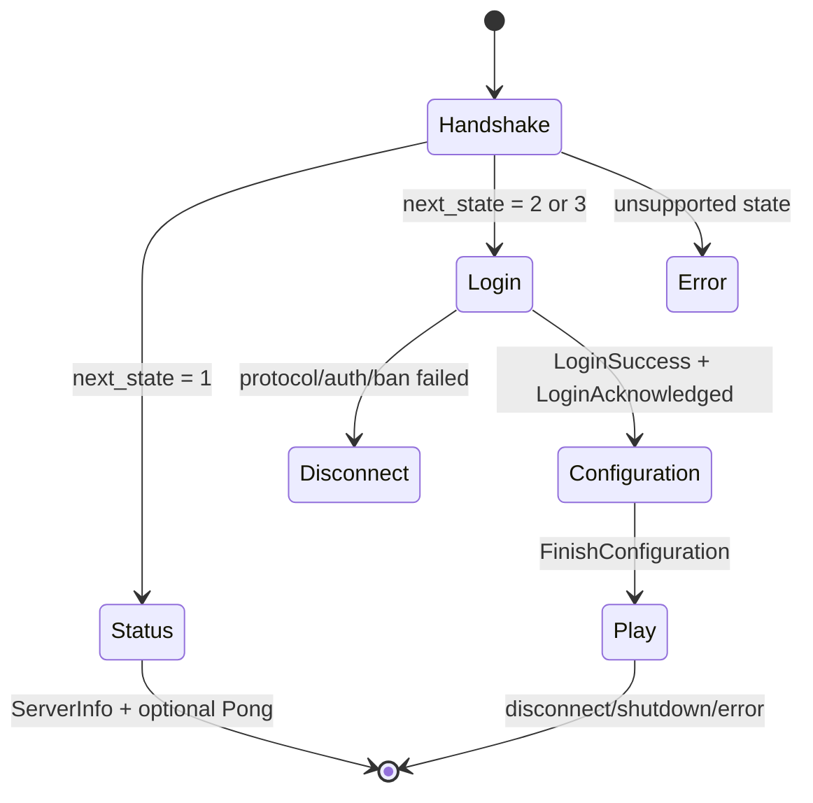

`connection::handle_inner()` 调用路径：

1. `tokio::io::split(stream)`。
2. `PacketStream::new(reader)` 和 `PacketSink::new(writer)`。
3. `read_expected_packet::<SetProtocol>()` 读取 handshake。
4. `next_state == 1` 调 `status::handle_status()`。
5. `next_state == 2 | 3` 调 `login::handle_login()`。

错误处理：

- 连接中断、BrokenPipe、ConnectionReset、UnexpectedEof 等属于预期断连，debug 记录。
- 其他错误按 error 记录。

## 8. Status 调用链

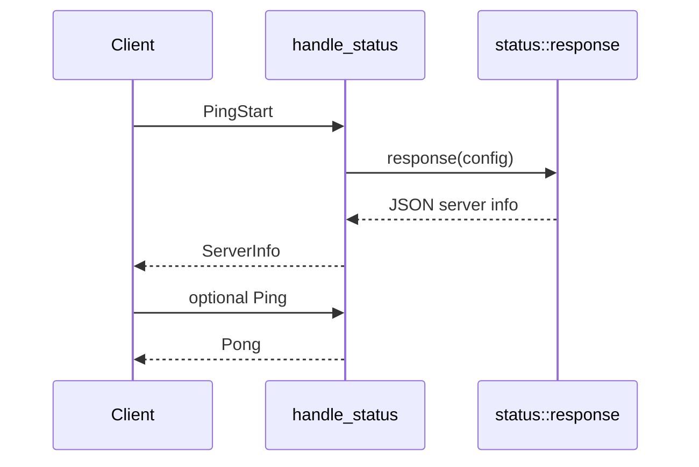

涉及模块：

- `connection/status.rs` 读取 `PingStart` 和可选 `StatusPing`。
- `status.rs` 根据配置生成 MOTD、玩家数、favicon 等 JSON。
- 发包通过 `qexed_protocol::to_client::status::*` 和 `PacketSink::send()`。

## 9. Login 与认证链路

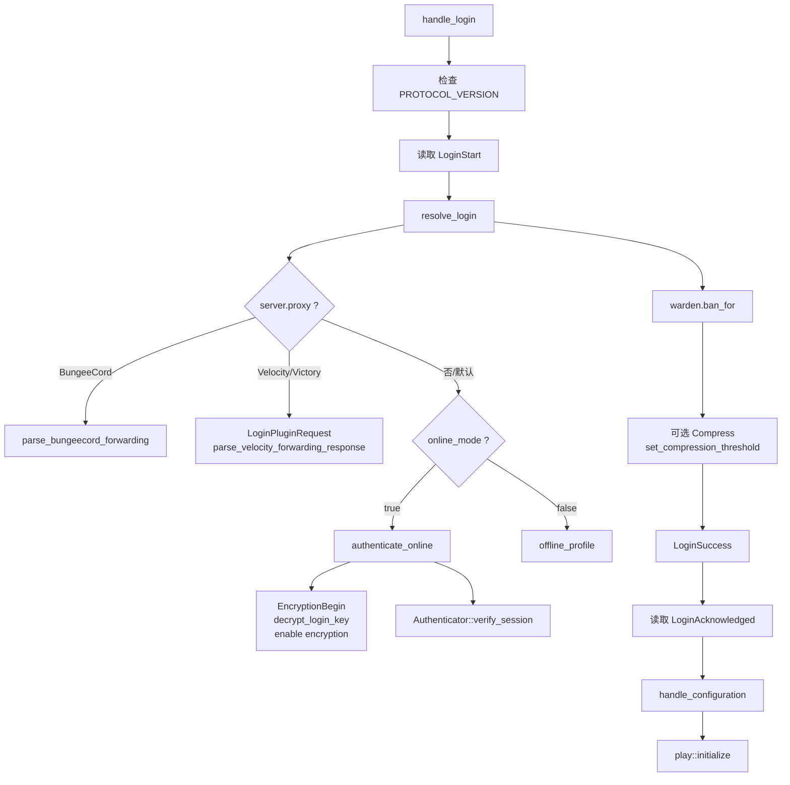

认证实现：

- `auth::Authenticator::new()` 生成/持有 RSA 私钥和 HTTP client。
- 在线认证通过 Mojang session server 校验 shared secret。
- Velocity/Victory 代理转发通过 plugin message 请求代理提供 profile。
- BungeeCord 通过 handshake host 字段解析转发数据。
- 离线模式使用 `offline_profile(username)` 生成离线 UUID。
- `WardenManager::ban_for(uuid)` 在 Play 前拦截封禁玩家。

## 10. Configuration 阶段

`connection/configuration.rs` 对应 Minecraft configuration state。

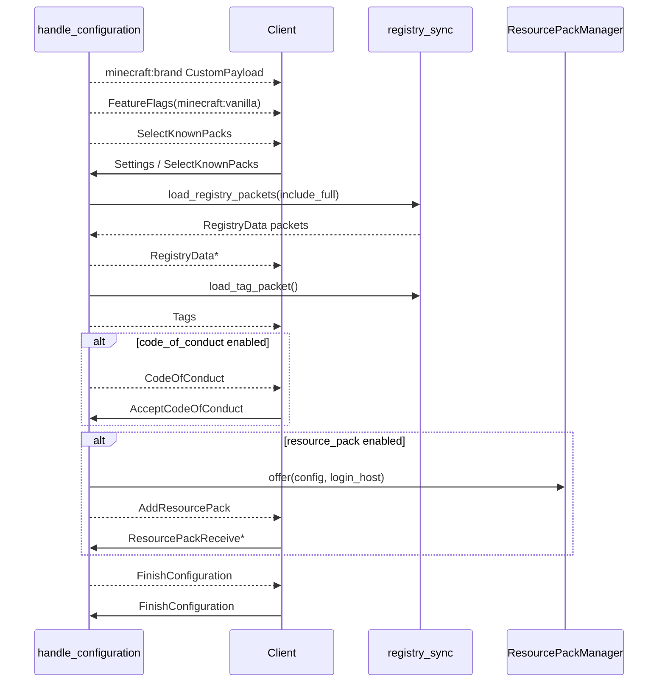

重要分支：

- 客户端接受 `minecraft:core` known pack 时，可以不发送完整 registry 内容。
- 行为准则文本由 `CodeOfConductTexts::select(locale)` 选择。
- 资源包可以是 URL、对象存储、或本地临时 HTTP 下载服务。
- required resource pack 失败时发送 configuration disconnect。

## 11. Play 初始化

`play::initialize()` 在登录与配置结束后进入游戏。

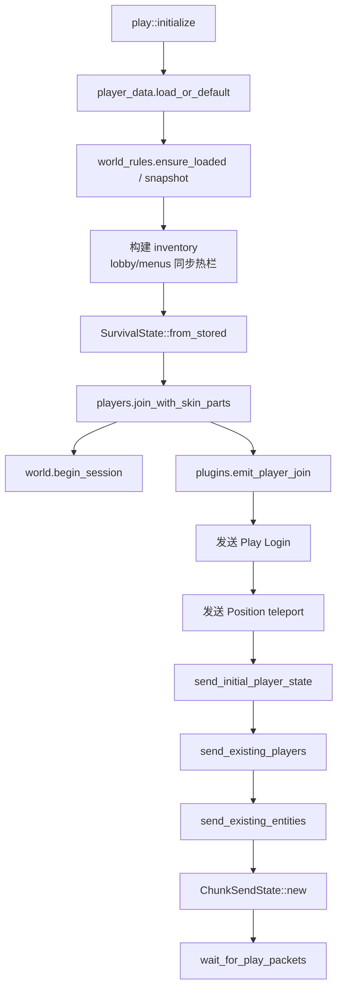

初始化后，`PlayerLeaveGuard` 确保离线时触发插件 leave 事件和玩家移除。

## 12. Play 主循环

`wait_for_play_packets()` 是业务最核心的事件循环，使用 `tokio::select!` 同时处理 tick、网络包和关停。

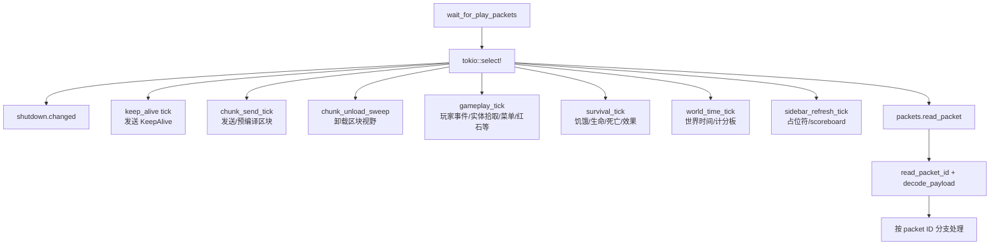

Play 阶段主要接收的 serverbound packet：

| 类别 | packet |
| --- | --- |
| 会话 | `AcceptTeleportation`、`ServerboundKeepAlive`、`ChunkBatchReceived`、`PlayerLoaded` |
| 命令/聊天 | `CommandSuggestion`、`ChatMessage`、`ChatCommand`、`ChatAck`、`ChatSessionUpdate` |
| 移动/输入 | `MovePlayerPos`、`MovePlayerPosRot`、`MovePlayerRot`、`MovePlayerStatusOnly`、`PlayerInput` |
| 物品/背包 | `SetCarriedItem`、`SetCreativeModeSlot`、`PickItemFromBlock`、`ContainerClick`、`ContainerButtonClick`、`ContainerClose` |
| 世界交互 | `UseItemOn`、`UseItem`、`PlayerAction` |
| 实体交互 | `Interact`、`Attack` |
| 其他 | `ClientCommand`、`ServerboundPlayerAbilities`、`ServerboundCustomPayload` |

典型处理链路：

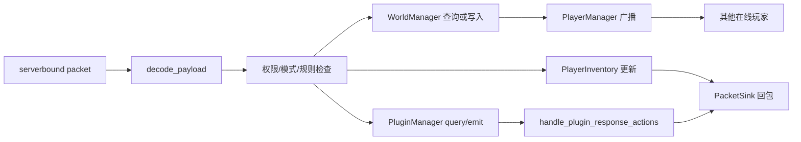

## 13. 聊天与命令

聊天相关路径：

- `ChatMessage`：限流、长度校验、可选 secure chat 校验、内容过滤、广播。
- `ChatCommand`：`chat::handle_chat_command()` 解析内置命令或插件命令。
- `CommandSuggestion`：内置命令、插件命令、权限过滤、返回 `CommandSuggestions`。
- `ChatSessionUpdate` / `ChatAck`：维护安全聊天 session 和 last-seen。

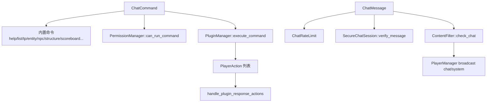

## 14. 世界与区块调用链

`WorldManager` 负责世界存储、生成、缓存、区块包、方块读写、光照和运行时编辑区域。

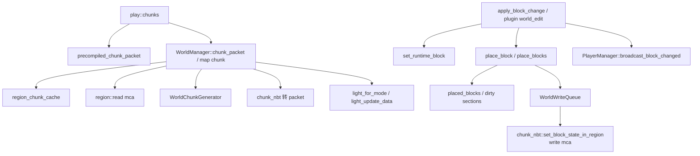

缓存与一致性：

- `region_chunk_cache` 缓存 region chunk 的压缩数据、解析后的 NBT、扁平 block states。
- `precompiled_chunk_cache` 缓存已经编码好的 chunk frame，减少重复编码。
- `block_state_cache` 缓存单个方块查询。
- 方块变更会 invalidate 对应 chunk 的预编译包和 block cache，并标记 dirty section。
- `WorldSession` 通过 active session 计数决定何时清理运行时缓存。
- `WorldWriteQueue` 使用专用线程串行化 region 写入，减少阻塞 Play loop。

世界生成器：

- `generator::from_config()` 根据配置选择空世界、flat、vanilla noise 等生成器。
- `ClusteredWorldGenerator` 可按 shard 路由远端区块。
- `world/generator/*` 按地形、carver、feature、ore、树、结构等拆分。

## 15. 方块交互与编辑

玩家破坏/放置典型路径：

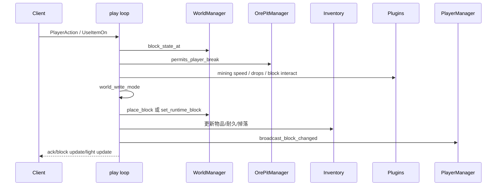

写入是否允许由 `world_write_mode()` 判断：

- `gameplay_block_updates` 是否开启。
- 当前 game mode 是否允许尝试编辑。
- 维度规则是否允许 block updates。
- 世界/维度是否 read-only。
- 是否匹配运行时编辑区域，且区域是否允许玩家 break/place 或插件 write。

## 16. 玩家管理

`crates/qexed/src/players.rs` 直接 re-export `qexed_player`。

`PlayerManager` 主要职责：

- 玩家加入：分配实体 ID，保存 `OnlinePlayer`。
- 玩家离开：移除玩家，广播 player info/entity remove。
- 位置和装备更新。
- 单播/广播 raw packet。
- `broadcast_block_changed()`、`teleport_player()`、`damage_player()` 等业务辅助。

调用方：

- `play::initialize()` 加入玩家。
- `play` loop 更新移动、装备、生命、背包、聊天。
- `entities::EntityManager` 用它给可见玩家发送实体 spawn/move/remove。
- `services` 和 `ore_pits` 用它传送或广播方块变化。
- 插件 host 的 world edit/entity control 通过 context 中的 players 广播变更。

## 17. 实体系统

`EntityManager` 管理静态实体、NPC、掉落物、怪物 AI、插件实体、自定义实体。

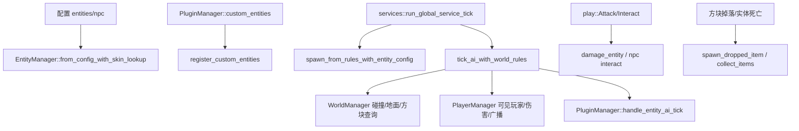

实体 AI 覆盖面：

- 物理：重力、碰撞、步高、自动跳跃、水平移动。
- 目标选择和寻路：最近玩家、pathfinding cache。
- 攻击和伤害：近战、投射物、爆炸、药水效果。
- 特定生物逻辑：苦力怕膨胀、史莱姆跳跃、末影人传送、守卫者攻击等。
- 插件 AI：按间隔构造 `EntityAiTickQuery`，插件返回 `EntityAiOperation`。

实体可见性：

- 根据 `EntityRendering` 的距离配置筛选可见玩家。
- 支持实体堆叠显示：同类实体数量达到阈值时隐藏部分实体并改变显示名。
- 对玩家发送 `AddEntity`、metadata、equipment、move/remove 等包。

## 18. 全局服务 tick

`services::spawn_global_services()` 创建全局后台 tick。

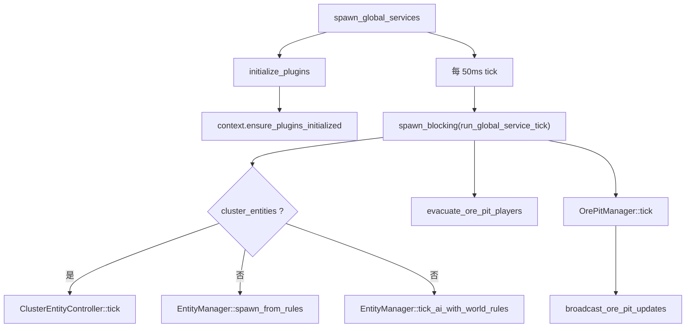

这个 tick 处理所有不依赖单个连接的全局逻辑，因此实体刷怪/AI 不被某个玩家连接的 packet loop 阻塞。

## 19. 插件系统

插件是 WASM 模块，目录默认 `plugins`。核心文件：

- `plugins.rs`：`PluginManager`、事件发射、查询、插件排序。
- `plugins/instance.rs`：Wasmtime 加载、实例化、调用导出函数。
- `plugins/host.rs`：宿主 API，向 WASM 暴露配置、存储、经济、世界编辑、实体控制、HTTP、本地化等。
- `qexed_plugin_api`：插件端和服务端共享的事件、payload、manifest。

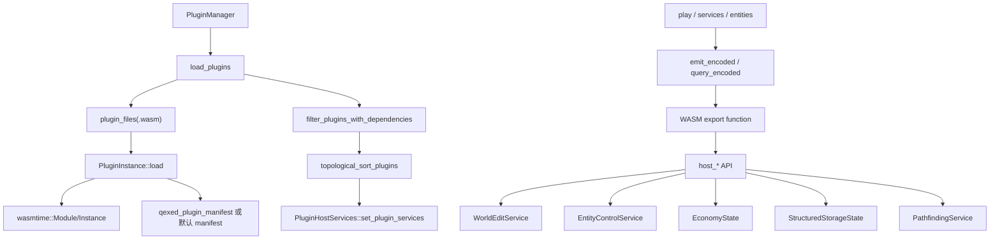

插件生命周期：

1. `context.ensure_plugins_initialized()` 只执行一次。
2. `PluginManager::ensure_loaded()` 扫描插件目录并加载 WASM。
3. 读取 manifest、事件导出、priority。
4. 过滤缺失硬依赖的插件。
5. 按 `depends`、`optional_depends`、`load_after`、priority 拓扑排序。
6. 触发 `Init`、`ConfigReload`、`LanguageChange`。
7. 注册自定义实体，并应用插件启动阶段 NPC mutation。

常见插件事件/查询路径：

| 触发点 | PluginManager 调用 |
| --- | --- |
| 玩家加入/离开 | `emit_player_join`、`emit_player_leave` |
| 区块加载/卸载 | `emit_chunk_load`、`emit_chunk_unload` |
| 挖掘速度/掉落 | `apply_mining_speed`、`apply_block_drops` |
| 合成/熔炉/附魔 | `apply_crafting_recipe`、`handle_craft_item`、`apply_furnace_recipe`、`apply_enchanting_options` |
| 命令 | `plugin_commands`、`execute_command` |
| NPC/实体 | `query_npc_mutations`、`custom_entities`、`handle_entity_ai_tick`、`handle_npc_interact` |
| 玩家事件 | `handle_player_move`、`handle_player_tick`、`handle_player_input`、`handle_player_block_step`、`handle_player_item_pickup` |
| 占位符 | `placeholder_replacements` |
| 声音/进度/药水/氧气 | `apply_sound`、`apply_advancement_grant`、`apply_potion_effect_tick`、`handle_player_oxygen_tick` |

Host API 安全边界：

- 所有宿主 API 读取 WASM memory 前检查 ptr、len、最大长度。
- 插件配置和文件存储路径禁止绝对路径、`..`、反斜杠、冒号等危险段。
- HTTP 只允许 `http://` / `https://`，默认 2 秒、最大 5 秒超时，限制 request/response 大小。
- world edit、entity control 通过 trait 注入，实际写世界/实体仍走服务端规则。

## 20. 玩家数据、权限、审计、封禁

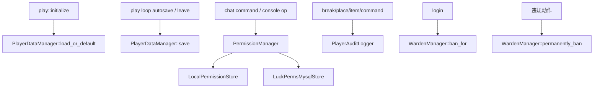

玩家数据：

- disabled：始终使用 spawn 默认值，不保存。
- vanilla：读写 `world/playerdata`。
- MongoDB/MySQL：通过配置的 collection/table 读写。

权限：

- 命令权限由 `commands::permission_node(command)` 转成节点。
- local 权限和 LuckPerms MySQL 都实现 `PermissionStore`。
- console 命令默认允许。

审计：

- `PlayerAuditLogger` 从配置创建 sink。
- 记录方块放置、破坏、物品切换、命令等玩家行为。

封禁：

- `WardenManager` 包装 `QexedWarden`。
- `ban_for()` 兼容旧的 `player_list` 和新的 `bans` 记录。
- `permanently_ban()` 更新配置并 `save_to_config()`。

## 21. 资源包、本地化、注册表

资源包：

```mermaid
flowchart TD
    Config["ResourcePack config"] --> Manager["ResourcePackManager::from_config"]
    Manager --> Disabled["Disabled"]
    Manager --> Url["Url"]
    Manager --> Object["ObjectStorage"]
    Manager --> Local["LocalResourcePack"]
    Local --> Http["local.start()\nTCP HTTP download server"]
    Configuration["handle_configuration"] --> Offer["manager.offer(config, login_host)"]
    Offer --> AddPack["AddResourcePack packet"]
```

注册表同步：

- `known_packs()` 返回 `minecraft:core` 和当前 `MC_VERSION`。
- `load_registry_packets(include_full)` 生成 configuration 阶段的 registry data。
- `load_tag_packet()` 发送 tags。
- `ensure_data_ready()` 检查本地 assets 或 Mojang cache。
- `lang_dir()` 为 `l10n::initialize()` 提供 Mojang language 文件目录。

本地化：

- `rust_i18n::i18n!("locales")` 用于服务端本地化。
- `l10n` 额外加载 Mojang lang，供物品/方块等显示名场景使用。
- `placeholders::format_placeholders()` 先替换内置 token，再询问插件替换。

## 22. 协议与 TCP 包层

```mermaid
flowchart TD
    Protocol["qexed_protocol packet struct"] --> PacketTrait["qexed_packet::Packet"]
    PacketTrait --> Codec["PacketCodec fields"]
    PacketTrait --> Macros["qexed_packet_macros::packet/substruct/subenum"]
    Sink["PacketSink::send"] --> Serialize["PacketWriter serialize"]
    Serialize --> Frame["VarInt length + packet id"]
    Frame --> Compress["optional zlib compression"]
    Compress --> Encrypt["optional AES-128-CFB8"]
    Encrypt --> TCPWrite["AsyncWrite"]

    TCPRead["AsyncRead"] --> Decrypt["optional AES-128-CFB8 decrypt"]
    Decrypt --> ParseLen["read_varint_prefix"]
    ParseLen --> Decompress["optional zlib decompress"]
    Decompress --> Payload["BytesMut payload"]
    Payload --> Decode["read_packet_id + Packet::deserialize"]
```

`PacketStream` 约束：

- 默认读缓冲 4096 字节。
- 默认最大 packet 8 MiB。
- 压缩帧先读 data length，再按 threshold 校验。
- 加密要求 shared secret 16 字节。

`PacketSink` 对应负责反向编码、压缩、加密和 flush。

## 23. NBT 与世界格式

`qexed_nbt` 提供：

- `Tag` 枚举：Byte、Short、Int、Long、Float、Double、String、Array、List、Compound、End。
- `NbtIo::from_reader()` / `to_writer()` 读写完整 NBT。
- `from_file()` 自动检测 gzip。
- `to_file()` 可选 gzip。
- `nbt_net`、`nbt_serde`、`net` 用于协议和 serde 集成。

主要调用方：

- `qexed_protocol::types::TextComponent` 等 NBT 类型。
- `world::region` 和 `world::chunk_nbt` 读写 MCA chunk。
- `inventory`、`commands`、`connection` 构造文本组件时使用 `Tag::Compound`。

## 24. 集群调用链

项目支持两类集群概念：

1. 世界生成 cluster：`ClusteredWorldGenerator` 根据 chunk 坐标路由远端 shard 获取 chunk/block。
2. 实体 cluster：`ClusterEntityController` 在 gateway 侧同步远端 shard 实体视图。

```mermaid
flowchart TD
    WorldConfig["world.cluster config"] --> Router["ClusterRouter"]
    Router --> Generator["ClusteredWorldGenerator"]
    Generator --> ShardRpc["cluster_rpc request"]
    ShardRpc --> Shard["cluster_shard::run"]
    Shard --> ShardWorld["WorldManager + EntityManager + PlayerManager"]
    Shard --> Response["Cluster response"]
    Response --> GatewayWorld["gateway WorldManager"]

    ServicesTick["services tick"] --> Controller["ClusterEntityController::tick"]
    Controller --> Snapshots["player snapshots"]
    Controller --> Shards["request shards near players"]
    Shards --> Packets["entity packet batches"]
    Packets --> Players["PlayerManager send raw packets"]
```

`cluster_shard::run()` 自身也构造独立的 `WorldManager`、`EntityManager`、`PlayerManager`，监听 TCP，处理 gateway 发来的 chunk/entity 请求。

## 25. 控制台与诊断

控制台相关：

- `console::spawn(context, shutdown_tx)` 启动 stdin reader 和命令执行 loop。
- `spawn_ctrl_c_shutdown()` 监听 Ctrl-C。
- 支持 help、status、players、plugins、reload、say、op、profile 等命令。
- `profile` 命令通过 `qexed_profiler::Profiler` 启停采样、生成 HTML 报告。

性能分析：

- `qexed_profiler::Profiler` 保存 span 统计、p99、调用树、火焰图数据、实体分布。
- `qexed::profile_span!()` 宏从全局 `OnceLock` 获取 profiler 并创建 guard。
- `Profiler::report_html()` 生成单文件 HTML 报告。

## 26. 工具与测试项目

`qexed_tools` 可执行文件：

| CLI | 作用 |
| --- | --- |
| `qexed_favicon_cli` | PNG 转 `server.favicon` data URL |
| `qexed_code_of_conduct_cli` | 编辑行为准则文本并切换配置 |
| `qexed_plugin_manager_cli` | 管理 `plugins` 目录下 WASM 插件 |
| `qexed_installer_cli` | 创建/解压 `.qxpack` 轻量安装包 |

`plugins/examples`：

- 示例插件 workspace，演示 SDK、小游戏、背包、棋类、实体、区块 trace、审计等插件事件使用方式。
- 服务端运行时只加载编译后的 `.wasm`，源码示例不直接参与 `qexed` 主程序调用。

`tools/mc-vanilla-protocol`：

- Java/Gradle 集成测试项目。
- 包含协议客户端、单服集成测试、迷宫/神庙等场景测试。

`tools/test_text_server`：

- Go 写的文本/内容过滤测试服务。
- 可配合 `ContentFilter` 的 API/知识库模式进行外部服务验证。

## 27. 常见追踪路线

读“玩家进服”：

```text
main.rs
-> bootstrap::load
-> ServerContext::new
-> server::run
-> connection::handle
-> login::handle_login
-> configuration::handle_configuration
-> play::initialize
-> play::wait_for_play_packets
```

读“破坏方块”：

```text
play::wait_for_play_packets
-> PlayerAction 分支
-> begin_destroy_block / can_finish_destroy_block
-> mining::required_break_duration
-> apply_block_change
-> WorldManager::place_block 或 set_runtime_block
-> PlayerManager::broadcast_block_changed
-> inventory / drops / audit / plugins
```

读“放置方块/右键交互”：

```text
play::wait_for_play_packets
-> UseItemOn 分支
-> handle_vanilla_block_interaction / handle_redstone_interaction / menus 等
-> apply_block_change
-> sync_held_item_after_world_edit
-> PlayerManager 广播
```

读“聊天命令”：

```text
play::wait_for_play_packets
-> ChatCommand
-> chat::handle_chat_command
-> permissions::PermissionManager
-> commands.rs 内置命令 或 PluginManager::execute_command
-> handle_plugin_response_actions
```

读“实体 AI”：

```text
services::run_global_service_tick
-> EntityManager::spawn_from_rules_with_entity_config
-> EntityManager::tick_ai_with_world_rules
-> world 碰撞/方块查询
-> players 可见性/伤害/广播
-> PluginManager::handle_entity_ai_tick
```

读“插件加载与调用”：

```text
ServerContext::new
-> PluginManager::load_default
-> services::initialize_plugins 或 login 后 ensure_plugins_initialized
-> PluginManager::ensure_loaded
-> PluginInstance::load
-> PluginManager::emit_* / query_*
-> PluginInstance::call_event / call_query
-> plugins::host::host_* API
```

读“区块发送”：

```text
play::initialize
-> ChunkSendState::new
-> wait_for_play_packets chunk_send_tick
-> play::chunks
-> WorldManager::precompiled_chunk_packet 或 chunk packet 构造
-> region/chunk_nbt/generator/light
-> PacketSink::send_raw / send
```

## 28. 代码阅读顺序建议

1. `crates/qexed/src/main.rs`：入口非常短，先建立主流程。
2. `crates/qexed/src/connection/context.rs`：看清 context 里有哪些核心服务。
3. `crates/qexed/src/server.rs`：理解 accept loop、关停和后台服务。
4. `crates/qexed/src/connection/*.rs`：理解 handshake、status、login、configuration。
5. `crates/qexed/src/play.rs`：先看 `initialize()` 和 `wait_for_play_packets()`，再按 packet 分支跳到辅助函数。
6. `crates/qexed/src/world/manager.rs`：看区块、方块、缓存和写队列。
7. `crates/qexed/src/entities/manager.rs`：看实体生成、AI、掉落物和插件 AI。
8. `crates/qexed/src/plugins.rs`、`plugins/instance.rs`、`plugins/host.rs`：看 WASM 插件边界。
9. `crates/qexed_tcp_connect`、`qexed_protocol`、`qexed_packet`：最后看底层协议和编码细节。

## 29. 设计观察

- KISS：主入口保持很短，复杂度集中在 context 和各 manager；读代码时按 manager 边界切入最直接。
- DRY：packet 编解码由 `qexed_packet` trait 和宏统一，玩家/实体基础模型拆到独立 crate 复用。
- YAGNI：很多功能通过配置开关或插件事件按需启用，例如资源包、玩家数据、权限、内容过滤、lobby。
- SOLID：`PlayerDataStore`、`PermissionStore`、插件 `PathfindingService` / `WorldEditService` / `EntityControlService` 都使用 trait 隔离具体实现，便于替换存储或宿主能力。

